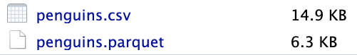

Now that we are producing a package, we expect that our functions will be used again and again. If these functions run slowly, that can become quite frustrating for the user!

Fortunately, we stand on the shoulders of giants. Many skilled computer scientists have put a lot of time and effort into writing R functions that run as fast as possible. Even without deep knowledge of computer algorithms and inner workings, we can still usually rework our code to make use of these existing tricks and tools.

# Find the slowdowns

We'll first need to find where the slow moments are in the code. This process - finding where exactly code slows down - is called *profiling*.

At its most basic level, profiling simply involves running small pieces of your code and timing how long they take.

::: callout-required-reading
[The tictoc and microbenchmark packages](https://www.jumpingrivers.com/blog/timing-in-r/)
:::

::: callout-required-reading
[The bench package](https://www.tidyverse.org/blog/2018/06/bench-1.0.1/)
:::

::: callout-required-reading
**Stat 541 Only**

In your work, you will most likely "profile" manually, by `tictoc`-ing bits of your code and so forth, not by the fancier methods used by professional programmers.

However, you should have an awareness of the major tools for more formally measuring coded performance. Skim the following readings - don't get too deep in the weeds! - to see how this process works for full-time developers.

[`lobstr::obj_size()`](https://lobstr.r-lib.org/reference/obj_size.html) [Profiling](http://adv-r.had.co.nz/Profiling.html#profiling) [Measuring Performance](https://adv-r.hadley.nz/perf-measure.html)
:::

## Tip: Only improve what needs improving

> “We should forget about small efficiencies, say about 97% of the time: premature optimization is the root of all evil. Yet we should not pass up our opportunities in that critical 3%. A good programmer will not be lulled into complacency by such reasoning, \[they\] will be wise to look carefully at the critical code; but only after that code has been identified.” — Donald Knuth.

Speed and computational efficiency are important, but there can be a trade off. If you make a small speed improvement, but your code becomes overly complex, confusing, or difficult to edit and test it's not worth it!

Also, consider your time and energy as the programmer. Suppose you have a function that takes 30-minutes to run. It relies on a subfunction that takes 30-seconds to run. Should you really spend your efforts making the subfunction take only 10-seconds?

::: callout-warning
The speed of code execution is very dependent on the hardware and software of the computer it is running on, and can also be affected by how many other programs the computer is running at the same time.

You might get very different speed results than others around you, or even different results on different tries!

However, the *relative* speed of various approaches should be the same - faster code will be faster on *all* computers.
:::

::: callout-check-in
1.  Here are two ways to compute the square root of a vector. Which is faster? Use profiling/benchmarking to test your answers!

```{r}
#| echo: true
#| eval: false
x ^ (1 / 2)
exp(log(x) / 2)
```

2.  Why is `mean(x)` slower than `sum(x)/length(x)`?

<!-- -->

a.  `sum()` is vectorized, while `mean()` is not.
b.  A mean is a smaller number than a sum, so it needs less memory.
c.  `mean()` calculates the mean twice just in case.
d.  `mean()` was written in an old version of R.
e.  `mean()` includes some extra steps to check the validity of the input.
:::

# Tricks to speed up analyses

Once we've found some places our code moves slowly, it's time to look for ways to make it better. We will explore three major ways to speed up data-centric code that do not require deep computer programming experience.

1.  More optimized data manipulation.

2.  Parallelizing repeated calculations.

3.  Storing datasets more efficiently.

## Optimal data wrangling with `data.table`

For speeding up work with data frames, while still running your code entirely within R, no package is better than `data.table`! This package was created in 2006 by Matt Dowle, for the sole purpose of performing common data wrangling tasks with the absolute most optimal algorithms.

Because the design is meant to mimic Base R style, `data.table` uses *very* different syntax from `dplyr`. Watch the following video for a quick introduction.



::: callout-important
[Blog post with many side-by-side examples of `data.table` and `dplyr` code](https://rdatatable-community.github.io/The-Raft/posts/2025-07-06-common_operations_datatable_and_dplyr-albert_rapp/)

[data.table cheatsheet](https://pbs.twimg.com/media/Dwoq0ZQXQAE5lJt.jpg)
:::

Luckily, because `dplyr` is so well-known, we have a nice trick for writing `dplyr` syntax to run `data.table` code: the `dtplyr` package. To use this package, simply load `library(dtplyr)`, convert your dataset into a `data.table` object using the `as_data_table()` function, and then write ordinary `dplyr` code. Your code will automatically be translated into `data.table` code (if possible) before executing.

For many data scientists, the functionality of `dtplyr` is sufficient. However, as an R programmer it is worth knowing the basics of `data.table` syntax, both to be able to read code written by others, and because many of the speedy algorithms of `data.table` do not have a `dplyr` equivalent.

::: callout-check-in
1.  Here is some `dplyr` code. Re-write it in `data.table` syntax.

```{r}
#| echo: true
#| eval: false

penguins %>%
  group_by(species) %>%
  summarize(mean_bill = mean(bill_length_mm))

```

2.  Using either the `tictoc` or `microbenchmark` packages, perform a speed test to see which code is faster and by how much.
:::

## Parallelizing

Often in data analysis, you are performing repeated calculations, such as computing summary statistics for many columns of a dataset at once.

In these cases, there is no reason you need to go in any particular order - in fact, you could have one computer calculate summaries for half the columns at the same time that another computer calculates summaries for the other half. This is the idea behind **parallelization**: the computer is told to "split" its computing power up and do all the calculations simultaneously.

::: callout-warning
The number of parallel processes a computer can run depends on its internal hardware. You may not be able to "split" your computer's work up into as many different simultaneous processes as someone else.
:::

There are many tools for parallelizing in R, of different levels of complexity. For our purposes, you probably won't need more than `furrr`. This package converts your `purrr::map()` iterations into parallel processes.

::: callout-required-reading
[Overview of `furrr`](https://furrr.futureverse.org/)
:::

::: callout-check-in
1.  When data is scraped from the web, you often have repeated processes, such as scraping each of many identical pages. Why would it be a bad idea to parallelize webscraping code?

<!-- -->

a.  It is important to get the pages in order to keep track of what you've done.

b.  If you get an error on one page you have to start at the beginning.

c.  Simultaneous scraping is likely to violate the rate limits from `robots.txt`

d.  It is impossible to access two different web pages at the same time.

<!-- -->

2.  Here is some iteration code. What would you change to make it run in parallel?

```{r}
#| eval: false
summ_stats <- function(column) {
  
  tibble(
    mean = mean(column, na.rm = TRUE),
    median = median(column, na.rm = TRUE),
    sd = sd(column, na.rm = TRUE)
  )
  
}

penguins |> 
  select(where(is.numeric)) |>
  map(.f = summ_stats) |>
  bind_rows()
```
:::

## Efficient data storage with `arrow` and *parquet*

In some data settings, the slowdown is not an analysis at all - it's loading the dataset into R. When a `.csv` file is very large, the `read_csv()` function can take an extremely long time to run.

Enter *parquet* files, one of the most magical advancements in data science in recent years. This file type stores data in extremely clever ways, going far beyond simple comma-separated text like in a `.csv`.

Even for a small dataset like `palmerpenguins`, the `.parquet` file containing the *exact same information* is less than **half** the size!

```{r}
#| eval: false
write_csv(penguins, "penguins.csv")
arrow::write_parquet(penguins, "penguins.parquet")

```



The `arrow` package is designed to help read and write parquet files. (It also provides a number of other helpful speed-ups, but we'll focus just on the parquet elements for now.)

::: callout-required-reading
[`arrow` cheatsheet](https://github.com/apache/arrow/blob/main/r/cheatsheet/arrow-cheatsheet.pdf)
:::

::: callout-check-in
1.  Run the following code to download a medium sized dataset from the `nycflights13` package as both a csv and parquet.

```{r}
#| eval: false

library(nycflights13)
library(arrow)

write_csv(flights, "flights.csv")
write_parquet(flights, "flights.parquet")
```

How much smaller was the parquet file compared to the csv?

2.  Use profiling to test the speed of reading the csv with `read_csv`, reading the csv with the `data.table` function `fread`, and reading the parquet file with `arrow`.
:::

### Data storage in packages

When you are working with data files on your computer, you can simply read and write them in *parquet* format as above.

When you want to include data with an R package, your process depends on the size. For very small data, you can include a `.Rdata` file that loads automatically with the package.

```{r}
#| eval: false
usethis::use_data(penguins)
```

However, when the data is large, this approach is not recommended - the resulting file will be require a lot of storage space, which might prevent it from being accepted on GitHub.

Instead, another option is to create an `inst` folder in your package repository. This folder is meant to contain any and all items that you want to be downloaded when users download your package. Inside the `inst` folder, you can make a folder called `extdata` ("external data"). Put any parquet or csv data files in there.

Then, users (or, your functions) can read the data from the package source with:

```{r}
#| eval: false

path <- system.file("extdata", "my_data.csv", package = "myPackage")
data <- read.csv(path)
```

Combining this structure with parquet files is a good way to add smaller data objects to a package!

## Optional: Super advanced mode

The following are some suggestions of ways you can level-up your code speed. These are outside the scope of this class, but you are welcome to explore them!

- [Create SQL-style databases with `duckdb`](https://borkar.substack.com/p/r-workflows-with-duckdb)
- [Dive deep into the R efficiency rabbit hole...](https://csgillespie.github.io/efficientR/)
- [Make your code run in C++ with Rcpp](http://adv-r.had.co.nz/Rcpp.html#rcpp)
- Learn to use [recursion](https://techvidvan.com/tutorials/recursion-in-r/)
- Learn more about [memory allocation](https://adv-r.hadley.nz/names-values.html) and [garbage collecting](http://adv-r.had.co.nz/memory.html) in R.
